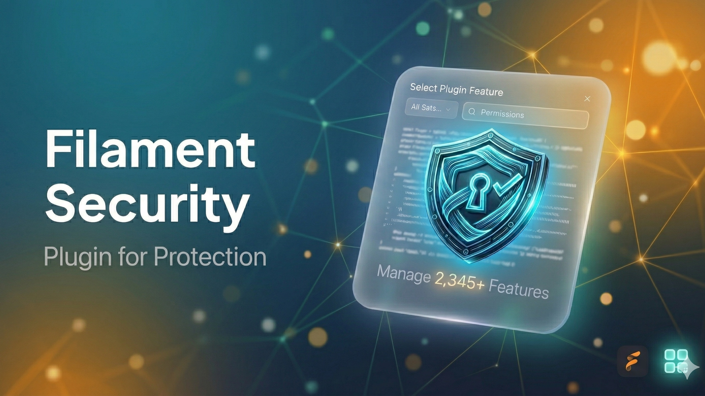
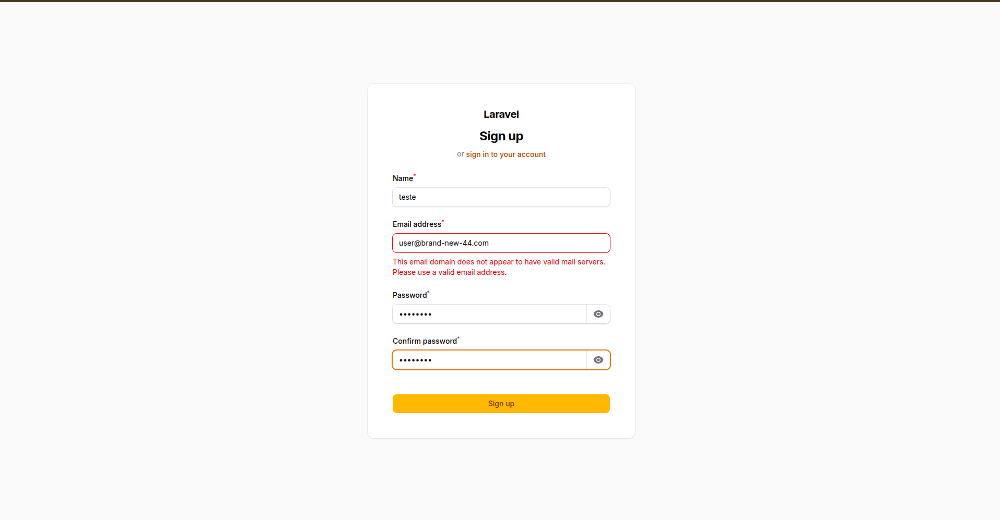
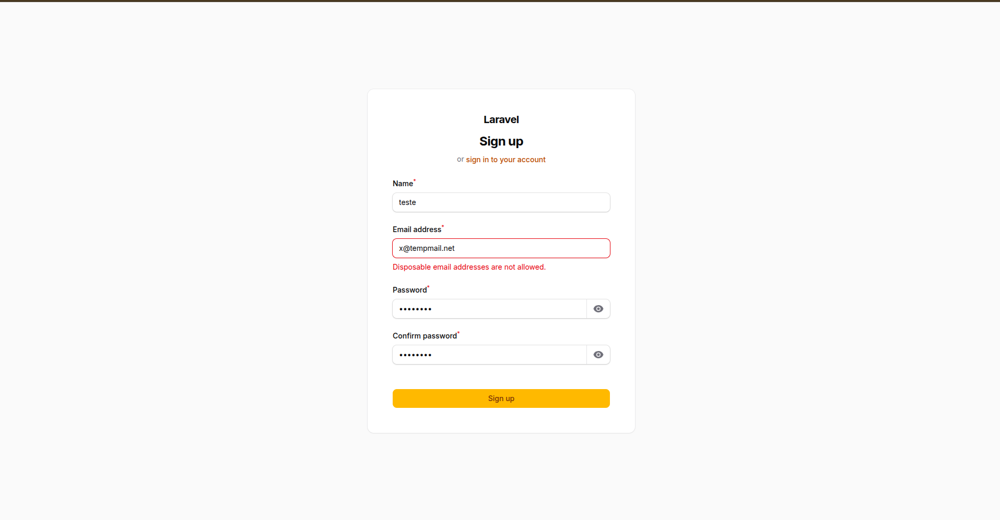
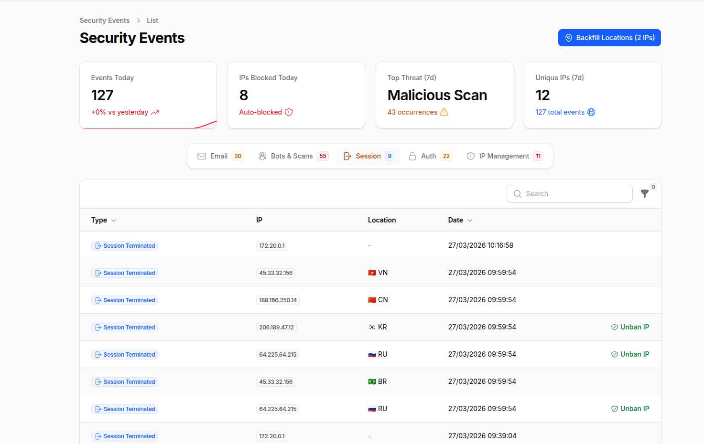
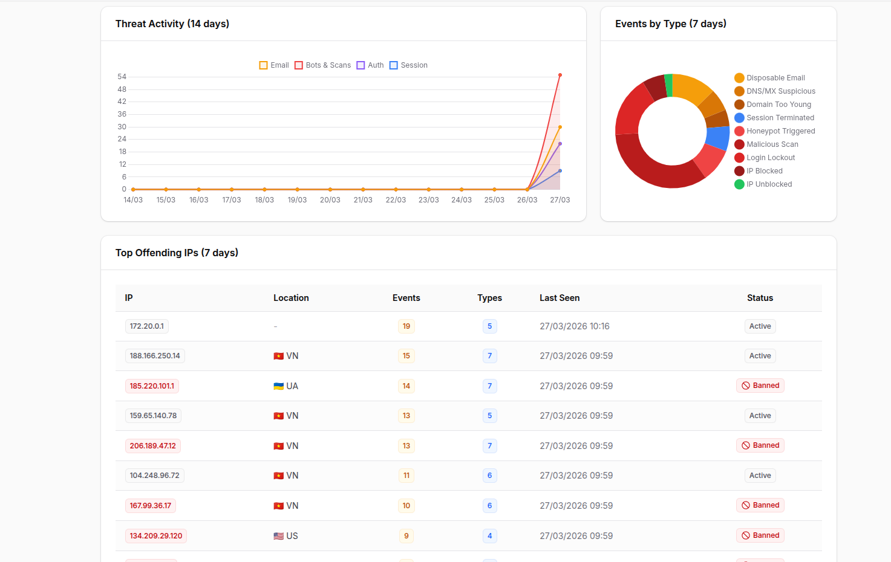

<p align="center">
    
</p>

# Filament Security

Security plugin for Filament v5 with eight protection layers: **disposable email blocking**, **DNS/MX verification**, **RDAP domain age check**, **single session enforcement**, **honeypot bot protection**, **Cloudflare IP blocking**, **malicious scan detection**, and a **security event dashboard** with real-time analytics.

## Screenshots

### Email Validation

| DNS/MX Verification | Disposable Email Blocking |
|:---:|:---:|
|  |  |

### Security Event Dashboard

| Stats, Tabs & Event Table | Charts & Top Offending IPs |
|:---:|:---:|
|  |  |

## Version Compatibility

| Package Version | Filament | Livewire | Laravel | Branch |
|-----------------|----------|----------|---------|--------|
| 2.x | v5 | v4 | 11 / 12 / 13 | `main` |
| 1.x | v4 | v3 | 11 / 12 / 13 | `1.x` |

## Requirements

- PHP 8.2+
- Laravel 11, 12 or 13
- Filament v5

## Installation

```bash
# Filament v5
composer require wallacemartinss/filament-security:"^2.0"

# Filament v4
composer require wallacemartinss/filament-security:"^1.0"
```

Publish the config file:

```bash
php artisan filament-security:install
```

If you enable the **Event Log** (Layer 8) or **Cloudflare IP Blocking** (Layer 6), publish and run the migrations:

```bash
php artisan vendor:publish --tag=filament-security-migrations
php artisan migrate
```

### Tailwind CSS (required for custom views)

If you use a custom Filament theme, add the plugin's source paths to your `resources/css/filament/admin/theme.css` so Tailwind can scan the plugin's views and classes:

```css
@source '../../../../vendor/wallacemartinss/filament-security/resources/views/**/*';
@source '../../../../vendor/wallacemartinss/filament-security/src/**/*';
```

Then rebuild your theme:

```bash
npm run build
```

Register the plugin in your `AdminPanelProvider` (**after** `->registration()`):

```php
use WallaceMartinss\FilamentSecurity\FilamentSecurityPlugin;

public function panel(Panel $panel): Panel
{
    return $panel
        ->login()
        ->registration() // Must come before ->plugins()
        // ...
        ->plugins([
            FilamentSecurityPlugin::make()
                ->disposableEmailProtection()  // Layer 1 (enabled by default)
                ->honeypotProtection()         // Layer 5 (enabled by default)
                ->singleSession()              // Layer 4
                ->maliciousScanProtection()    // Layer 7
                ->cloudflareBlocking()         // Layer 6
                ->eventLog(),                  // Layer 8 — Security dashboard
        ]);
}
```

## Layer 1: Disposable Email Blocking

Blocks registration with temporary/disposable email addresses. Ships with **192,000+ built-in domains** (sourced from [disposable/disposable-email-domains](https://github.com/disposable/disposable-email-domains)) and supports custom domains.

Covers all major disposable email providers including Mailinator, YOPmail, GuerrillaMail (all 11 variants), TempMail, ThrowAway, Burner Mail, and thousands more.

### Filament Registration Integration

When `disposableEmailProtection()` is enabled, the plugin **automatically** replaces the default Filament registration page with a secured version that validates emails against the disposable domain list. No extra configuration needed.

The plugin only replaces the default `Register::class`. If you have a custom registration page, use the trait instead:

```php
use Filament\Auth\Pages\Register;
use WallaceMartinss\FilamentSecurity\Auth\Concerns\HasDisposableEmailProtection;

class CustomRegister extends Register
{
    use HasDisposableEmailProtection;
}
```

### Usage as Validation Rule

```php
use WallaceMartinss\FilamentSecurity\DisposableEmail\Rules\DisposableEmailRule;

// In any form request or validator
'email' => ['required', 'email', new DisposableEmailRule],
```

### Usage in Filament Forms

```php
use Filament\Forms\Components\TextInput;
use WallaceMartinss\FilamentSecurity\DisposableEmail\Rules\DisposableEmailRule;

TextInput::make('email')
    ->email()
    ->rules([new DisposableEmailRule])
```

### Programmatic Check

```php
use WallaceMartinss\FilamentSecurity\DisposableEmail\DisposableEmailService;

DisposableEmailService::isDisposable('user@mailinator.com'); // true
DisposableEmailService::isDisposable('user@gmail.com');      // false
```

### Managing Custom Domains

```bash
php artisan filament-security:domain add spam-provider.com
php artisan filament-security:domain remove spam-provider.com
php artisan filament-security:domain list
php artisan filament-security:domain stats
```

### Configuration

```php
'disposable_email' => [
    'enabled' => env('FILAMENT_SECURITY_DISPOSABLE_EMAIL', true),
    'cache_enabled' => env('FILAMENT_SECURITY_CACHE', true),
    'cache_ttl' => 1440,
    'custom_domains' => [],
    'whitelisted_domains' => [],
],
```

### Domain Sources (priority order)

| Source | Location | How to manage |
|--------|----------|---------------|
| Built-in | `data/disposable-domains.json` | Shipped with package (192,000+ domains) |
| Custom file | `storage/filament-security/custom-domains.txt` | `php artisan filament-security:domain` |
| Config | `config/filament-security.php` | Edit config file |
| Whitelist | `config/filament-security.php` | Edit config file (overrides all) |

## Layer 2: DNS/MX Verification

Verifies that the email domain has valid mail infrastructure. Blocks domains that **cannot receive email** — domains with no MX records and no A/AAAA fallback, or domains with MX records pointing to suspicious targets (localhost, private IPs).

### How it works

```
Email submitted → Extract domain → Check MX records
  ├─ Has MX → Validate targets (reject localhost, private IPs, loopback)
  ├─ No MX → Check A/AAAA records (RFC 5321 fallback)
  │   ├─ Has A/AAAA → Allow (can receive email via implicit MX)
  │   └─ No records → Block (domain cannot receive email)
  └─ DNS error → Allow (fail-open, don't block legitimate users)
```

### Enabled by default

DNS/MX verification is enabled by default. No extra setup required.

### Usage as Validation Rule

```php
use WallaceMartinss\FilamentSecurity\DisposableEmail\Rules\DnsMxRule;

'email' => ['required', 'email', new DnsMxRule],
```

### Programmatic Check

```php
use WallaceMartinss\FilamentSecurity\DisposableEmail\DnsVerificationService;

DnsVerificationService::isSuspicious('user@nonexistent-domain.xyz'); // true
DnsVerificationService::isDomainSuspicious('fake-domain.xyz');       // true
```

### Configuration

```php
'dns_verification' => [
    'enabled' => env('FILAMENT_SECURITY_DNS_CHECK', true),
    'cache_enabled' => env('FILAMENT_SECURITY_CACHE', true),
    'cache_ttl' => 60,
],
```

### What is detected

| Condition | Result |
|-----------|--------|
| No MX, no A, no AAAA records | **Blocked** |
| MX pointing to `localhost` or private IP | **Blocked** |
| Valid MX records | **Allowed** |
| No MX but has A/AAAA record | **Allowed** (RFC 5321) |
| DNS lookup fails | **Allowed** (fail-open) |

## Layer 3: Domain Age Verification (RDAP)

Checks the domain registration age via [RDAP](https://about.rdap.org/) (Registration Data Access Protocol). Blocks recently registered domains — a common pattern in spam, phishing, and fraud campaigns.

### Disabled by default

This feature makes external HTTP calls to RDAP servers. Enable it via `.env`:

```env
FILAMENT_SECURITY_DOMAIN_AGE=true
FILAMENT_SECURITY_DOMAIN_MIN_DAYS=30
```

### Usage as Validation Rule

```php
use WallaceMartinss\FilamentSecurity\DisposableEmail\Rules\DomainAgeRule;

'email' => ['required', 'email', new DomainAgeRule],
```

### Programmatic Check

```php
use WallaceMartinss\FilamentSecurity\DisposableEmail\RdapService;

RdapService::isDomainTooYoung('user@brand-new-domain.com'); // true
$date = RdapService::getRegistrationDate('example.com');     // Carbon|null
```

### Configuration

```php
'domain_age' => [
    'enabled' => env('FILAMENT_SECURITY_DOMAIN_AGE', false),
    'min_days' => env('FILAMENT_SECURITY_DOMAIN_MIN_DAYS', 30),
    'block_on_failure' => env('FILAMENT_SECURITY_DOMAIN_AGE_STRICT', false),
    'cache_enabled' => env('FILAMENT_SECURITY_CACHE', true),
    'cache_ttl' => 1440,
],
```

### Failure behavior

| Scenario | `block_on_failure=false` (default) | `block_on_failure=true` |
|----------|-----------------------------------|------------------------|
| RDAP server unreachable | Allow | Block |
| TLD not in IANA bootstrap | Allow | Block |
| No registration date in response | Allow | Block |
| Domain age >= min_days | Allow | Allow |
| Domain age < min_days | Block | Block |

## Layer 4: Single Session Enforcement

Ensures only **one active session per user**. When a user logs in from a new browser or device, all previous sessions are immediately terminated. Works with **database**, **Redis**, and **file** session drivers.

### How it works

```
User logs in on Browser A → Session A created, tracked as active
User logs in on Browser B → Session B created
  → Login event fires → Session A destroyed
  → Middleware updates active session to B
User returns to Browser A → Session A no longer exists → Redirected to login
```

### Disabled by default

```env
FILAMENT_SECURITY_SINGLE_SESSION=true
```

### Session driver support

| Driver | Destruction method | Enforcement |
|--------|-------------------|-------------|
| `database` | Bulk DELETE by `user_id` | Immediate |
| `redis` | Destroy session key via handler | Immediate + middleware fallback |
| `file` | Destroy session file via handler | Immediate + middleware fallback |

### Programmatic Usage

```php
use WallaceMartinss\FilamentSecurity\SingleSession\SingleSessionService;

SingleSessionService::handleLogin($user);
SingleSessionService::clearTracking($user->id);
```

### Configuration

```php
'single_session' => [
    'enabled' => env('FILAMENT_SECURITY_SINGLE_SESSION', false),
],
```

## Layer 5: Honeypot Protection

Protects registration forms against bots using invisible honeypot fields. Powered by [spatie/laravel-honeypot](https://github.com/spatie/laravel-honeypot).

Two invisible fields are injected into the registration form:

1. **Empty field** - Bots auto-fill all fields; if this field has a value, the submission is rejected
2. **Timestamp field** - Tracks how fast the form was submitted; instant submissions are rejected

### Enabled by default

```php
FilamentSecurityPlugin::make()
    ->honeypotProtection()
```

### Custom Registration Page

```php
use Filament\Auth\Pages\Register;
use WallaceMartinss\FilamentSecurity\Auth\Concerns\HasHoneypotProtection;

class CustomRegister extends Register
{
    use HasHoneypotProtection;
}
```

When spam is detected, the request is aborted with `403 Forbidden`. A `SpamDetectedEvent` is also fired for logging or IP blocking (Layer 6).

## Layer 6: Cloudflare IP Blocking

Automatically blocks suspicious IPs on Cloudflare WAF after repeated failed login attempts or bot detection via honeypot.

```
Failed Login → RateLimiter counts attempts → Exceeds threshold → Cloudflare API block
Honeypot Spam → Instant Cloudflare API block
```

Real client IP resolved through: `CF-Connecting-IP` > `X-Real-IP` > `X-Forwarded-For` > `REMOTE_ADDR`

### Setup

1. Add your Cloudflare credentials to `.env`:

```env
FILAMENT_SECURITY_CLOUDFLARE=true
CLOUDFLARE_API_TOKEN=your_api_token_here
CLOUDFLARE_ZONE_ID=your_zone_id_here
```

2. Publish and run the migration:

```bash
php artisan vendor:publish --tag=filament-security-migrations
php artisan migrate
```

3. Enable in the plugin:

```php
FilamentSecurityPlugin::make()
    ->cloudflareBlocking()
```

### How to get your Cloudflare credentials

#### API Token

1. Go to [Cloudflare Dashboard > My Profile > API Tokens](https://dash.cloudflare.com/profile/api-tokens)
2. Click **"Create Token"** > **"Create Custom Token"**
3. **Permissions:** `Zone` > `Firewall Services` > `Edit`
4. **Zone Resources:** `Include` > `Specific zone` > select your domain

#### Zone ID

1. Go to [Cloudflare Dashboard](https://dash.cloudflare.com) and select your domain
2. On the **Overview** page, scroll down to the right sidebar > **API** section > copy **Zone ID**

### Managing Blocked IPs

```bash
php artisan filament-security:blocked-ips list
php artisan filament-security:blocked-ips status
php artisan filament-security:blocked-ips block 203.0.113.50 --reason="Manual block"
php artisan filament-security:blocked-ips unblock 203.0.113.50 --force
```

### Programmatic Usage

```php
use WallaceMartinss\FilamentSecurity\Cloudflare\BlockIpService;
use WallaceMartinss\FilamentSecurity\Cloudflare\IpResolver;

$ip = IpResolver::resolve();
app(BlockIpService::class)->blockIp($ip, 'Custom reason');
app(BlockIpService::class)->unblockIp($ip);
app(BlockIpService::class)->recordFailedAttempt($ip, 'Failed login');
app(BlockIpService::class)->remainingAttempts($ip);
```

### Configuration

```php
'cloudflare' => [
    'enabled' => env('FILAMENT_SECURITY_CLOUDFLARE', false),
    'api_token' => env('CLOUDFLARE_API_TOKEN'),
    'zone_id' => env('CLOUDFLARE_ZONE_ID'),
    'max_attempts' => env('FILAMENT_SECURITY_CF_MAX_ATTEMPTS', 5),
    'decay_minutes' => env('FILAMENT_SECURITY_CF_DECAY_MINUTES', 30),
    'mode' => env('FILAMENT_SECURITY_CF_MODE', 'block'),
    'note_prefix' => 'FilamentSecurity: Auto-blocked',
],
```

## Layer 7: Malicious Scan Protection

Detects and blocks requests to known exploit paths, config files, web shells, and CMS admin pages. Returns `404` and logs the attempt as a security event.

### What is detected

| Category | Examples |
|----------|---------|
| Config/env files | `.env`, `.git`, `.htaccess`, `wp-config.php` |
| Package files | `composer.json`, `package.json`, `yarn.lock` |
| Credentials | `credentials.json`, `firebase.json`, `database.json` |
| WordPress/CMS | `wp-admin`, `wp-login`, `xmlrpc.php` |
| Web shells | `shell.php`, `cmd.php`, `c99`, `r57`, `webshell` |
| Exploit paths | `etc/passwd`, `proc/self`, `../../..` |
| Admin panels | `phpmyadmin`, `adminer`, `pgadmin`, `cPanel` |
| Debug endpoints | `phpinfo`, `_debug`, `_profiler`, `actuator` |

### Disabled by default

```env
FILAMENT_SECURITY_MALICIOUS_SCAN=true
```

```php
FilamentSecurityPlugin::make()
    ->maliciousScanProtection()
```

The middleware is automatically registered in the `web` middleware group when enabled.

### Configuration

```php
'malicious_scan' => [
    'enabled' => env('FILAMENT_SECURITY_MALICIOUS_SCAN', false),
],
```

## Layer 8: Security Event Dashboard

A complete Filament resource that records and visualizes all security events across every layer. Provides a real-time dashboard with stats, charts, and a threat intelligence table.

### What is recorded

Every layer in the plugin automatically records events when the Event Log is enabled:

| Event Type | Source Layer | Trigger |
|------------|-------------|---------|
| `disposable_email` | Layer 1 | Disposable email blocked during registration |
| `dns_mx_suspicious` | Layer 2 | Domain with no valid mail servers |
| `domain_too_young` | Layer 3 | Domain registered too recently |
| `session_terminated` | Layer 4 | User session killed by newer login |
| `honeypot_triggered` | Layer 5 | Bot detected via honeypot |
| `login_lockout` | Layer 6 | Failed login attempt |
| `ip_blocked` | Layer 6 | IP blocked on Cloudflare |
| `ip_unblocked` | Layer 6 | IP unblocked via panel |
| `malicious_scan` | Layer 7 | Exploit path accessed |

### Setup

1. Enable in `.env`:

```env
FILAMENT_SECURITY_EVENT_LOG=true
```

2. Publish and run the migration:

```bash
php artisan vendor:publish --tag=filament-security-migrations
php artisan migrate
```

3. Enable in the plugin:

```php
FilamentSecurityPlugin::make()
    ->eventLog()
```

### Dashboard features

The Security Events page includes:

**Header Widgets (4 stat cards):**
- Events Today (with trend vs yesterday + 7-day mini chart)
- IPs Blocked Today
- Top Threat (7 days)
- Unique IPs (7 days)

**Tabs (filtered by category):**
- Email — disposable emails, DNS/MX, domain age
- Bots & Scans — honeypot, malicious scans
- Session — terminated sessions
- Auth — login lockouts
- IP Management — blocked/unblocked IPs

**Footer Widgets (3 charts):**
- Threat Activity (14-day line chart by category)
- Events by Type (7-day doughnut chart)
- Top Offending IPs (table with top 10 attackers, event count, location, ban status)

**Table features:**
- Live polling every 30 seconds
- Dynamic columns per tab (email, path, user_agent, trigger info)
- Copyable IP badges
- Country flags with city/org tooltip
- Type filter (multi-select)

**Actions:**
- **Backfill IP Locations** — header action to enrich IPs without geolocation via IpInfo API
- **Unban IP** — row action to remove Cloudflare block directly from the table

### Programmatic Usage

```php
use WallaceMartinss\FilamentSecurity\EventLog\Models\SecurityEvent;

// Record a custom security event
SecurityEvent::record('custom_event_type', [
    'email' => 'user@example.com',
    'domain' => 'example.com',
    'metadata' => ['reason' => 'Custom reason'],
]);
```

### Configuration

```php
'event_log' => [
    'enabled' => env('FILAMENT_SECURITY_EVENT_LOG', false),
],
```

## IpInfo Integration (Optional)

Enrich security events with IP geolocation data (country, city, organization) from [ipinfo.io](https://ipinfo.io). This is **completely optional** — if no token is provided, everything works without geolocation.

### Setup

1. Get a free API token at [ipinfo.io/signup](https://ipinfo.io/signup)
2. Add to `.env`:

```env
IPINFO_TOKEN=your_token_here
```

### How it works

- When a security event is recorded, the IP is **automatically enriched** with country, city, and org data
- Results are **cached for 24 hours** per IP to minimize API calls
- The **Backfill Locations** action in the dashboard lets you retroactively enrich existing events
- If the token is not set, geolocation is silently skipped

### Configuration

```php
'ipinfo' => [
    'token' => env('IPINFO_TOKEN'),
    'timeout' => 5,
    'cache_ttl' => 1440, // minutes (24h)
],
```

## Environment Variables

```env
# Disposable Email (Layer 1)
FILAMENT_SECURITY_DISPOSABLE_EMAIL=true   # Enable/disable disposable email blocking
FILAMENT_SECURITY_CACHE=true              # Enable/disable caching (shared across features)

# DNS/MX Verification (Layer 2)
FILAMENT_SECURITY_DNS_CHECK=true          # Enable/disable DNS/MX check (default: enabled)

# Domain Age / RDAP (Layer 3)
FILAMENT_SECURITY_DOMAIN_AGE=false        # Enable/disable domain age check
FILAMENT_SECURITY_DOMAIN_MIN_DAYS=30      # Minimum domain age in days
FILAMENT_SECURITY_DOMAIN_AGE_STRICT=false # Block when RDAP lookup fails

# Single Session (Layer 4)
FILAMENT_SECURITY_SINGLE_SESSION=false    # Enable/disable one session per user

# Honeypot (Layer 5)
FILAMENT_SECURITY_HONEYPOT=true           # Enable/disable honeypot protection

# Cloudflare (Layer 6)
FILAMENT_SECURITY_CLOUDFLARE=false        # Enable/disable Cloudflare blocking
CLOUDFLARE_API_TOKEN=                     # Cloudflare API token
CLOUDFLARE_ZONE_ID=                       # Cloudflare zone ID
FILAMENT_SECURITY_CF_MAX_ATTEMPTS=5       # Failed attempts before blocking
FILAMENT_SECURITY_CF_DECAY_MINUTES=30     # Time window for counting attempts
FILAMENT_SECURITY_CF_MODE=block           # 'block' or 'challenge'

# Malicious Scan (Layer 7)
FILAMENT_SECURITY_MALICIOUS_SCAN=false    # Enable/disable malicious scan detection

# Security Event Log (Layer 8)
FILAMENT_SECURITY_EVENT_LOG=false         # Enable/disable security event dashboard

# IpInfo (Optional geolocation)
IPINFO_TOKEN=                             # IpInfo API token (optional)
```

## Testing

```bash
php artisan test packages/filament-security/tests/
```

## Translations

The package includes translations in **15 languages**: English, Brazilian Portuguese, German, Spanish, French, Italian, Japanese, Korean, Dutch, Polish, Russian, Turkish, Ukrainian, Arabic, and Chinese (Simplified).

To publish translations:

```bash
php artisan vendor:publish --tag=filament-security-translations
```

## License

MIT License. See [LICENSE](LICENSE) for details.
